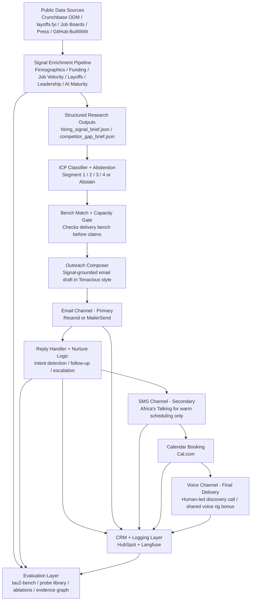

# Conversion Engine for Sales Automation (Tenacious Challenge)

This repo implements a **signal-grounded enrichment pipeline** and supporting modules for the Tenacious challenge.
It turns public signals (Crunchbase ODM sample, job posts, layoffs.fyi, leadership mentions, and derived AI maturity)
into structured research artifacts that downstream components use for **ICP classification** and **confidence-aware outreach phrasing**.

## Architecture



## Quickstart

### 1) Install dependencies

From repo root:

```bash
python3 -m pip install -r agent/requirements.txt
python3 -m playwright install chromium
```

### 1b) (Optional) Run the UI dashboard

The repo includes a Next.js dashboard under `ui/` that loads prospects from backend storage, calls the FastAPI product endpoints, and renders the generated briefs.

Terminal 1 (API):
```bash
uvicorn agent.main:app --reload --port 8000
```

Terminal 2 (UI):
```bash
npm run dev
```

If you have not installed the UI dependencies yet:
```bash
cd ui
npm install
```

Open `http://localhost:3000`.

Prospects are loaded from `data/prospects.json` by default. You can change the store path with `PROSPECTS_STORE_PATH`.

For Render:
- Backend: `https://conversion-engine-for-sales-automation.onrender.com`
- UI should set `AGENT_API_URL` to your backend URL (see `ui/README.md`).
- `resend` is the default outbound email provider. Set `RESEND_API_KEY` and `RESEND_FROM_EMAIL` for the normal path.
- Set `EMAIL_PROVIDER=mailersend` with `MAILERSEND_API_KEY` and `MAILERSEND_FROM_EMAIL` if you want outbound delivery and inbound reply routing through MailerSend instead.
- Set `LIVE_OUTBOUND=false` to activate the kill-switch and block live outbound email, booking-link sends, and SMS.

### 2) Generate the hiring signal brief (core artifact)

```bash
python3 -m agent.enrichment.briefs --company "Consolety" --out-dir data/briefs
```

Output example:
- `data/briefs/hiring_signal_brief_consolety_2026-04-23.json`

API (FastAPI):
- Start the service: `uvicorn agent.main:app --reload --port 8000`
- Generate brief: `POST /enrichment/hiring-brief` with body `{ "company_name": "Consolety", "domain": null, "use_playwright": false, "out_dir": "data/briefs" }`

Example:
```bash
curl -s -X POST http://127.0.0.1:8000/enrichment/hiring-brief \\
  -H "Content-Type: application/json" \\
  -d '{"company_name":"Consolety","use_playwright":false,"out_dir":"data/briefs"}'
```

Central merger CLI (no API):
```bash
python3 -m agent.enrichment.pipeline --company "Consolety" --out-dir data/briefs
```

### 3) Generate the competitor gap brief

```bash
python3 -m agent.enrichment.competitor_gap --company "Consolety" --out-dir data/briefs
```

### 4) Classify ICP segment (with abstention)

```bash
python3 -m agent.enrichment.icp --brief data/briefs/hiring_signal_brief_consolety_2026-04-23.json
```

### 5) Generate the market-space map and validation report

```bash
python3 -m agent.market_map
```

Outputs:
- `data/processed/market_map/market_map_report.json`
- [methodology.md](/home/bethel/Documents/10academy/Conversion Engine for Sales Automation/methodology.md)
- [memo_page_2.md](/home/bethel/Documents/10academy/Conversion Engine for Sales Automation/memo_page_2.md)
- [data_handling_policy.md](/home/bethel/Documents/10academy/Conversion Engine for Sales Automation/data_handling_policy.md)

## Enrichment signals (what the brief contains)

The brief schema includes:
`company`, `funding`, `jobs`, `layoffs`, `leadership_change`, `ai_maturity`, `tech_stack`, `meta`.

Each signal section contains a `_confidence` field so the composer can choose **assert vs hedge vs ask** language.

### Crunchbase firmographics + funding
- Module: `agent/enrichment/crunchbase.py`
- Local-only lookup: `lookup_company(name) -> dict | None`
- Produces: firmographics, funding recency (`is_recently_funded`), and a compact brief (`build_firmographics_brief`)

CLI:
```bash
python3 -m agent.enrichment.crunchbase --name "Consolety" --brief --out data/processed/crunchbase/
```

### Job posts (engineering/AI roles + velocity)
- Module: `agent/enrichment/job_posts.py`
- Scrapes common careers URLs; supports Playwright headless (no login/captcha bypass logic).
- Produces: `total_open_roles`, `engineering_roles`, `ai_ml_roles`, `velocity_60d`, `signal_strength`

CLI:
```bash
python3 -m agent.enrichment.job_posts --domain stripe.com --use-playwright
```

Note: `velocity_60d` becomes available once you have a prior snapshot stored in SQLite cache.

### Layoffs (last N days)
- Module: `agent/enrichment/layoffs.py`
- Reads: `data/raw/layoffs/layoffs.csv`
- Produces: `had_layoff`, `days_ago`, `headcount_cut`, `percentage_cut`, `segment_implication`

CLI:
```bash
python3 -m agent.enrichment.layoffs --name "Meta" --days 120
```

### Leadership change (local sources)
- Module: `agent/enrichment/leadership.py`
- Inputs: local list of `{text, date, source}` items (press snippets / announcements).
- Produces: `new_leader_detected`, `role`, `name`, `days_ago`, `confidence`, `source`

CLI:
```bash
python3 -m agent.enrichment.leadership --company "TechCo" --sources-json '[{"text":"TechCo appoints Sarah Chen as CTO","date":"2026-03-01","source":"press"}]'
```

### AI maturity (0–3)
- Module: `agent/enrichment/ai_maturity.py`
- Produces: `score`, `confidence`, `justification.per_signal`, `pitch_language_hint`
- Segment-4 is hard-gated when `score < 2`.

## Caching (SQLite)

- Module: `agent/enrichment/cache.py`
- Default DB: `data/cache.db`
- Override: `ENRICHMENT_CACHE_DB=/path/to/cache.db`

All enrichment modules use the cache so repeat runs don’t re-enrich the same company.

## Tests

```bash
python3 -m unittest discover -s tests -p 'test_*.py'
```

## Outbound Kill-Switch

The measurable pause control is `LIVE_OUTBOUND`.

- `LIVE_OUTBOUND=true`: live outbound is allowed.
- `LIVE_OUTBOUND=false`: the backend returns `403` for `/emails/send`, `/prospects/{id}/send-outreach`, booking-link sends, and `/sms/send`.

Pause the system when **any** of these conditions is met:

1. `wrong_signal_rate_7d > 4%` and `confirmed_wrong_signal_complaints_7d >= 3`, measured from CTO/VP Eng complaint tracking after manual review.
2. `research_reply_rate_14d < 3%` for `2` consecutive full weeks, measured from delivered outbound plus reply webhooks.
3. `brand_complaint_named_prospect >= 1`, where a named CTO or VP Engineering prospect explicitly flags a factual error or brand-damaging claim.

Rollback procedure:

1. Set `LIVE_OUTBOUND=false`.
2. Pause the active campaign in the outbound provider.
3. Review the last `50` briefs plus the previous `14` days of complaint and reply logs.
4. Fix the signal logic, rerun tests, and only re-enable outbound after manual sign-off.

## Service API (SMS)

The FastAPI service and SMS routes are documented in `agent/README.md`.

## Output locations

- Hiring brief JSON: `data/briefs/hiring_signal_brief_<company>_<YYYY-MM-DD>.json`
- Competitor gap JSON: `data/briefs/competitor_gap_brief_<company>_<YYYY-MM-DD>.json`
